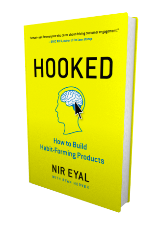

name: title
class: center, middle, inverse

## Hooked!
### Retain and engage your customers through habit formation.
#### Luke Carbis

[View on [GitHub](https://github.com/lukecarbis/hooked)]

[Press .highlight[P] to view notes]

???

* https://github.com/lukecarbis/hooked

Habit forming products and services change the behaviour of our clients, and increase their engagement with our business.

Habits:
* Increase Customer Lifetime Value (CLTV)
* Provide pricing flexibility
* Supercharge growth
* Sharpen your competitive edge (clients irrationally overvalue the old over the new)

---

name: introduction
class: center, middle, inverse

### Hooked, by Nir Eyal

&ldquo;Hooked gives you the blueprint for the next generation of products. Read Hooked or the company that replaces you will.&rdquo;

&mdash; _Matt Mullenweg_

???

This Presentation is based heavily on the book Hooked by Nir Eyal

---

name: model
class: center, middle

# Hook Model

### .trigger[Trigger]
### .action[Action]
### .reward[Reward]
### .investment[Investment]

???

* 79% of smart phone owners check their device within 15 minutes of waking up
* It's estimated that the average smart phone user checks their device 150 times per day
* One third of Americans say that they would rather give up sex than their mobile phone

We're hooked. Habit forming technology is here.

The question now becomes, how can we use it?

In this presentation we'll look at a model which helps us to understand the psychology of forming a habit.

A trigger is the spark which ignites a behaviour. This is the first step in forming a habit.

Once a behaviour has been triggered, there should be a clear action: A behaviour done in anticipation of a reward.

Once the action has occurred, the client should receive a variable reward. This established a craving.

Finally, we ask the client to do a bit of work. This creates deeper user engagement, and reloads the trigger.

The model is a loop, which cycles (at a frequency which will be different in different contexts) until our client is hooked.

We'll look at each of these steps in depth, and discuss how we can use them in our businesses.

---

name: superpower
class: center, middle

# With Great Power

### &nbsp;

### Would I use the product myself?

### Would it help clients improve their lives?

???

What's the difference between a healthy habit and an addiction?

The ability to create habits is a superpower. It can be used for evil.

We should be aware of the moral implications. Rather than asking "Can I hook my clients?" we should first be asking "Should I hook my clients?"

We can find an answer by asking these two questions:

Would I use the product myself?

Would it help clients improve their lives?

---

name: trigger
class: center, middle

# Trigger

### External & Internal

???

There are two types of triggers: External triggers, and Internal triggers.

External triggers are information delivered to your client, telling them what to do next. Some examples:

* An email
* A letter in the mail
* An advertisement
* A phone notification or text message

They can be subtle. For example, a coke vending machine will sometimes display the preposition "Thirsty?". This is an external trigger - are you thirsty? The trigger tells you somewhat explicitly that if you are thirsty, you should drink a coke.

An external trigger comes in four flavours:

1. Paid, such as advertising or Google Adwords
2. Earned, such as media attention, or viral videos
3. Relationship, such as referrals
4. Client Owned, such as an email or push notification

But external triggers are a means to an end. Ideally, what we're aiming for is to establish internal triggers.

In the case of the coke machine above, the ideal situation is that you notice that you're thirsty without seeing the sign, and that triggers you to buy a coke.

Internal triggers are related to a thought, emotion, or existing routine. To find your target internal trigger, you need a deep understanding of how your clients feel.

Facebook uses boredom as an internal trigger. Instagram uses loneliness as an internal trigger. Powerade uses finishing a workout or sport as an internal trigger.

**Exercise**

Let's run through an example business.

- Who is the client?
- What is the user doing right before your intended habit?
- What would be an appropriate time and place to send an external trigger?
- What is an internal trigger that could cue your user to action?
	- 5 Whys
- How can we couple the internal trigger as closely as possible with the external trigger?

---

name: action
class: center, middle

# Action

### Behaviour = Motivation + Ability + Trigger

???

If a user does not take action, the trigger is useless.

The action must be easier than thinking. A habit is a behaviour with little or no conscious thought.

The Fogg Behaviour Model (B = MAT) says that a behaviour will only occur if there is motivation, ability and a trigger. Without any one of these, the action will not occur.

For example, my phone is in my handbag.

* Is there motivation? I notice that the call is from a private number, it's probably a telemarketer. I don't answer.
* Is there ability? My phone is buried somewhere in the bag, I can't find it. I don't answer.
* Is there a trigger? My phone is on silent, I don't hear it. I don't answer.

What can we do to motivate our clients? Fogg explains that we are all motivated to:

* seek pleasure, avoid pain
* seek hope, and avoid fear
* seek social acceptance, avoid rejection

Our action should be geared toward one of these levers, rather than being task based.

Facebook asks us to "Like", social acceptance. Lorna Jane tells us that being fit feels great (pleasure). Obama's election campaign was based on hope.

What about Ability? We should make it as easy as possible for our clients to complete an action. Always asking the question:

"How can this be easier?"

Easier equals better.

**Exercise**

- Starting with the trigger, and ending with the intended outcome, what does a client need to do?
- How many steps?
- What resources are limiting the client's ability to accomplish the tasks?
	- Time
	- Brain cycles
	- Money
	- Physical effort
- Can we make it any simpler?

---

name: reward
class: center, middle

# Variable Reward

### The Tribe, the Self, and the Hunt

???

Our clients come to us with a problem. Now is the time to provide a solution. Now is the time to scratch their itch.

Studies have shown that what draws us to keep coming back is not the reward itself, but the need to alleviate a craving for the reward.

The key to rewards is variability. When we learn what to expect, we become bored, and the habit dies. But when something breaks the cause-and-effect pattern, we become aware and engaged.

There are three reward types:

1. The Tribe

Our brains seek rewards that make us feel socially accepted, attractive, important and included.

Facebook rewards users with the Likes and Shares of their friends.

2. The Hunt

Our brains feel the need to acquire and collect objects.

Slot Machines are a classic example. People keep pumping in dollars in pursuit of the jackpot.

Pinterest is another example, people hunt around on Pinterest in order to collect objects of desire.

3. The Self

People are fuelled by an intrinsic motivation to be more competent - to master or complete something. We strangely even pursue these rewards even when we don't enjoy them.

The gym rewards people with the satisfaction of completing a workout.

Tabletop puzzles are incredibly difficult and frustrating, yet they reward with this intrinsic satisfaction.

Video Games cause players to grind levels over and over, in order to achieve better stats and improve scores.

**Exercise**

- What are you rewarding your customers with?
- What is enjoyable or satisfying about this reward?
- How can the reward be more variable?
- What is a way you can make your product or service more rewarding through:
	- The Tribe (gratification from others)
	- The Hunt (material goods, money, information)
	- The Self (mastery, completion, consistency)

---

name: investment
class: center, middle

# Investment

### Content, Data, Followers, Reputation, Skill

???

The more your clients invest time and effort into your product or service, the more they value it and recommend it.

Labour leads to love.

We have a predilection to display behaviour consistent with our past behaviour. We can create large changes in our clients behaviour over time, by starting small, and being consistent.

For example, if we want our client to refer us to their colleagues, you can start by asking for a testimonial for our website. One month later, you could ask for a twitter retweet. A month after that, perhaps a social media recommendation. A month after that, ask if you can write a guest post for their blog. Soon, you can ask the client if they would reach out to a particular lead whom you both know.

There are 5 ways we can ask our users to store value in our business.

1. Content

Either aggregating content for the client, or asking the client to create new content.

iTunes asks users to invest in their service by adding songs to their collection.

2. Data

Information generated or collected by our clients.

In addition to creating content in Xero, it also asks us to link our bank accounts so that it can record all the data relating to our business finance.

3. Followers

Being seen as a leader in your product or service is a huge investment.

Nobody with a large following will leave twitter and start somewhere else.

4. Reputation

Having the users establish a reputation over time is an investment in your product or service.

eBay sellers with a good reputation are deeply invested in the service.

5. Skill

Learning to use a complicated product is an investment in itself.

Adobe Photoshop users are unlikely to try competitors, because they have invested time into learning how to use Photoshop.

These investments can also be used to load the next trigger.

If you invest in Facebook by writing a post, you are loading the external "notification" trigger to tell you when someone has liked it.

This will loop back into action, reward, and investment.

**Exercise**

- Review your workflow
- What "bit of work" are you asking your clients to do?
- Brainstorm a way of adding a small investment to your product or service which:
	- Stores value
	- Loads the next trigger

---

name: notes
class: center, middle, inverse

### You can view this presentation at
### https://lukecarbis.github.io/hooked

or

### download and contribute at
### https://github.com/lukecarbis/hooked
